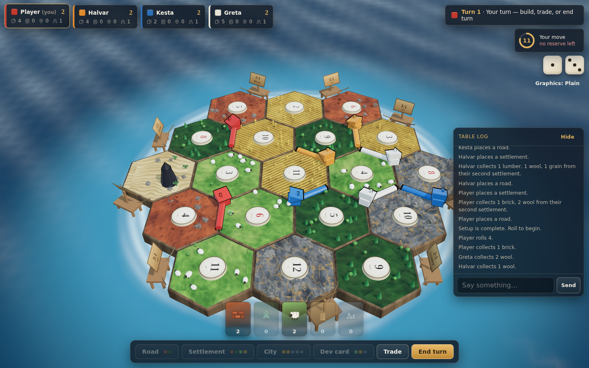

# Hexhaven

An open-source 3D island trading-and-settlement game you can host and play
online with friends. Original artwork, an authoritative multiplayer server,
and a complete implementation of the classic hex-tile rules.



<sub>Rendered in a headless browser from this repository — every texture and
model in the shot is generated by the code, not loaded from a file.</sub>

---

## What this is

A web game in the tradition of the classic hex-tile settlement board games:
you place settlements on the corners of an island of nineteen tiles, collect
the resources those tiles produce when their number is rolled, trade, build
roads and cities, and race to ten victory points.

Three things set it apart from most open-source takes on the genre:

- **It looks like a game, not a diagram.** The board is a real 3D scene —
  bevelled tiles with relief-mapped terrain, forests and flocks and rock
  fields, an animated sea with a foam shoreline, and pieces that cast
  shadows in warm afternoon light.
- **The server is authoritative.** Clients send *intentions*, never state.
  Every action is validated against the rules engine before it changes
  anything, and each player receives a view with everyone else's hand and the
  deck order stripped out.
- **The rules are actually complete.** Including the parts implementations
  usually skip: the bank-shortage rule, longest road as an exact search,
  the one-development-card-per-turn restriction, and harbour trade rates.

### On the artwork and the name

This is not a clone of any commercial product and shares no assets with one.
Every texture, model and icon here is generated by the code in this
repository — see `packages/client/src/three/textures.ts` and `geometry.ts`,
where terrain is painted from noise at load time and every model is built
from primitives. Board game *rules* are not copyrightable, but names, logos
and artwork are, so Hexhaven uses its own name and its own art throughout.

---

## Quick start

Requires Node 20 or newer to build and run, and Node 22 for the test suite,
which uses the runtime's TypeScript stripping. There is an `.nvmrc`, so
`nvm use` picks the right one.

```bash
nvm use            # optional, selects Node 22
npm install
npm run build
npm start          # http://localhost:8080
```

For development, with hot reload on the client and a watching server:

```bash
npm run dev        # client on :5173, server on :8080
```

If a build ever fails with an unresolvable import from `packages/shared/dist`,
reset the build output and try again:

```bash
npm run rebuild    # clean, then build
```

Open the client, choose a name, create a table, and either share the
four-letter code with friends or fill the empty seats with bots.

---

## Deploying it

The app is deploy-agnostic: one Node process serves both the client bundle and
the websocket server, and `Dockerfile` packages the whole thing.

**Docker, anywhere**

```bash
docker build -t hexhaven .
docker run -p 8080:8080 hexhaven
# or: docker compose up --build
```

**Fly.io** — `fly.toml` is included and configured not to scale a machine to
zero while players are connected:

```bash
fly launch --no-deploy   # once, to pick a name and region
fly deploy
```

**Render** — `render.yaml` is a ready blueprint; point Render at the repo.

**Static client + separate server.** If you would rather host the client on
Pages, Netlify or any CDN, build it with `VITE_SERVER_URL` pointing at the
game server and deploy `packages/client/dist` as a static site:

```bash
VITE_SERVER_URL=https://your-server.example.com npm run build:client
```

The server needs websockets, so it cannot itself be a static host. Note that
`/healthz` reports room and session counts for uptime checks.

---

## How it is put together

```
packages/
  shared/   rules engine, board topology, protocol types — no I/O, no DOM
  server/   express + ws; owns every game, validates every action
  client/   react + three.js; renders views and sends intentions
```

`shared` is the interesting part, and both other packages depend on it. Since
the engine has no I/O, the same code validates moves on the server, highlights
legal placements in the client, and drives the bots in tests.

The server consumes `shared` as compiled JavaScript, because Node has to run
it. The client instead aliases it to the TypeScript source, so the client
bundle does not depend on a separate build step having run first, and edits to
the rules engine appear in the dev server without a rebuild.

Each package writes its incremental TypeScript cache *inside* its own output
directory. That sounds like a detail and is not: `tsc -b` trusts that cache,
so a cache left behind beside `tsconfig.json` after the output was deleted
will convince it there is nothing to emit, and the build then fails much later
with an unresolvable import. Keeping the two together means deleting the
output always deletes the cache describing it.

### Board topology

Corners and edges are identified *structurally* rather than by index: a corner
**is** the set of three hexes meeting at it, and an edge **is** the set of two
hexes sharing it. Sorting those sets into a canonical string key means the
same corner reached from any of its three tiles produces one identifier.

That one decision removes most of the fiddly work. Adjacency needs no lookup
tables — two corners are neighbours when they share two hexes — and a corner's
world position is simply the centroid of its three tile centres, which on a
regular grid is exactly the shared corner point. It also makes the invariants
easy to assert: the standard island has 19 tiles, 54 corners and 72 edges, and
the tests check all three.

### The engine

`applyAction` is a validating reducer. Every action is checked against an
explicit `pending` discriminant describing what the game is waiting for, so an
out-of-order, replayed or hostile client message is rejected rather than
half-applied. It throws `RuleError`, which callers treat as "reject this
message" rather than as a crash.

Two rules are worth calling out because they are commonly got wrong:

- **Longest Road** is an exact longest-*trail* search: edges may not repeat but
  a corner may be crossed twice, so figure-eights score correctly, and an
  opposing settlement severs a route at that corner. Greedy walks get branches
  and loops wrong. Road networks cap at fifteen segments, so exhaustive DFS
  from every edge in both directions is both cheap and always right.
- **Bank shortages.** When the bank cannot pay everyone owed a resource on a
  roll, nobody receives it — unless exactly one player is owed any, in which
  case they take what remains.

### Privacy

The server never sends a client anything it should not know. `viewFor` builds
a per-player view: your own hand is exact, everyone else is reduced to counts,
and the development deck order and RNG state never leave the server. Log
entries carrying hidden information — which card you bought, which resource a
robber took — are delivered in full only to the players involved and stripped
to their public sentence for everyone else.

### Disconnections

Sessions are token-based. A dropped socket holds its seat for two minutes
while the bot policy covers its turns, and reconnecting with the stored token
restores the seat mid-game. The client reconnects on its own with backoff.

---

## Testing

```bash
npm test          # rules engine and board topology
npm run typecheck # all three packages
```

The suite includes 24 complete bot-versus-bot games that assert a set of
invariants **after every individual action**: resource conservation
(bank plus hands always totals 19 of each), development-deck conservation,
piece counts, that no two buildings are ever adjacent, that the robber stands
on land, and that no two players hold the same award. Those checks are what
catch a rules bug that scripted tests walk straight past — the bot deadlock
and the played-card accounting error in this repo's history were both found
that way, not by a unit test.

There is also an end-to-end smoke check that plays a full four-player game
over real websockets against a running server:

```bash
PORT=8099 HEXHAVEN_BOT_THINK_MS=0 node packages/server/dist/index.js &
node packages/server/test/smoke.mjs
```

`HEXHAVEN_BOT_THINK_MS` sets the pause a bot takes between moves. It defaults
to 650ms, which exists only so human players can follow what a bot did;
setting it to `0` plays a full game in a couple of seconds.

It asserts host-only permissions, that no private state appears on the wire,
and that a token reconnect restores the seat.

---

## Rules implemented

| Area | Detail |
| --- | --- |
| Board | 19 tiles, 54 corners, 72 edges, 9 harbours; classic, random or "no touching red numbers" layouts |
| Setup | Snake draft; the second settlement pays out its surrounding tiles |
| Production | Per-roll payouts, doubled for cities, blocked by the robber, with the bank-shortage rule |
| Robber | Forced discard above seven cards, move, and a random steal |
| Building | Roads, settlements, cities, with the distance rule, road connection, blocking at opposing settlements, and piece limits |
| Development | 25 cards; one per turn; not the turn you bought it; victory points stay hidden |
| Trading | 4:1 bank, 3:1 generic and 2:1 specific harbours, and player-to-player offers |
| Awards | Longest Road (5+, strictly longer to take) and Largest Army (3+, strictly more) |
| Victory | 10 points by default, claimed only on your own turn |

Configurable per table: target points, island layout, and an optional turn clock.

---

## Things worth knowing

- **Bots** are heuristic, not search-based. They score positions with the rules
  of thumb a human learns first — pips, resource variety, harbours — and spend
  down a priority list. That plays a recognisably sane game and, more usefully,
  never stalls a room waiting on a long think.
- **No downloaded assets.** Terrain textures are painted into canvases at load
  time with a height field that a Sobel pass turns into a normal map; the
  environment map is a procedural sky rendered into a cube map and pre-filtered.
  Nothing is fetched from a CDN at runtime.
- **The board explains the rules.** Only legal targets ever light up, so if a
  corner does not glow, you cannot build there.

## Where this is going

`docs/DEPLOYMENT.md` covers the single-engine architecture, the environments
and pipeline needed to run this for real players, and why the visual target is
an asset-pipeline problem rather than an engine one.
`docs/ROADMAP.md` covers the three open questions in detail: closing the
visual gap with an authored art pipeline, reaching phones without forking the
client, and turning the engine seam into a platform that can host more than
one game. `CHANGELOG.md` records what each release actually contains.

## Licence

MIT. See [LICENSE](LICENSE).
